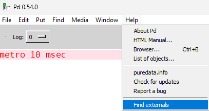
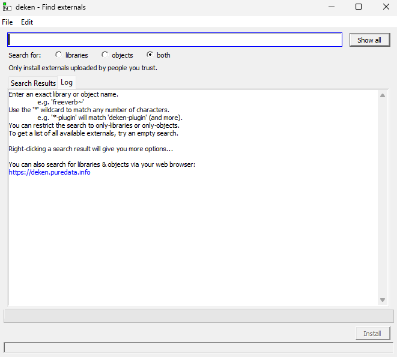

# puredata

## install external lib 

1. Help / Find externals

2. find the right lib and click install

## Good To Install

|lib|description|
|--|--|
|**comport**|allow serial communication (arduino, esp etc...)|